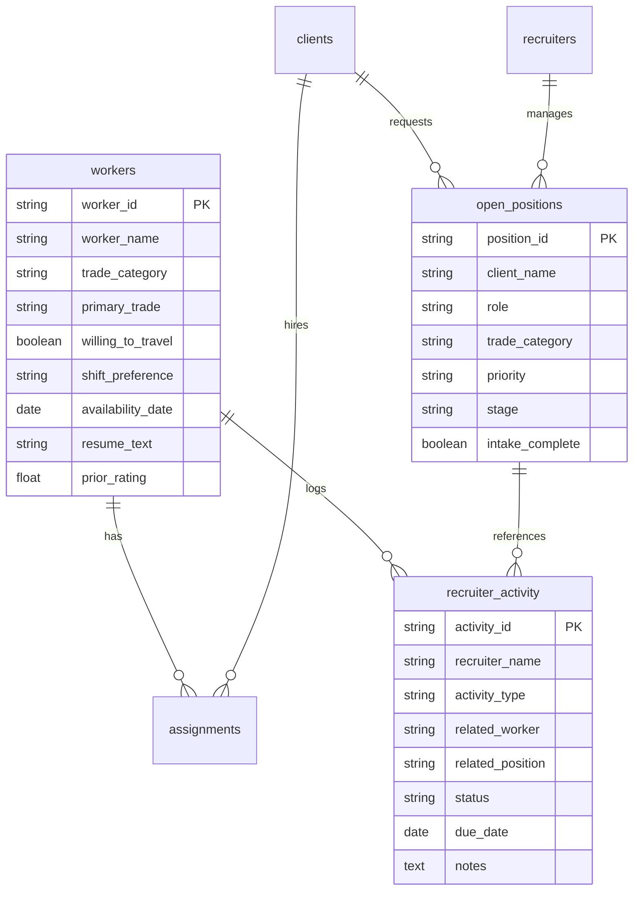

# Custom Light ATS/CRM Roadmap & Architecture

This document serves as a permanent reference for the multi-stage evolution of the **Trades Resource Command Center** from a visual dashboard into a lightweight, fully functional, production-ready ATS/CRM tailored for small recruiting firms.

---

## Strategic Value Proposition

1. **Extreme Simplicity:** Replaces complex, underutilized enterprise ATS dashboards with a focused, 1-click operational command center.
2. **Fractional Cost:** Eliminates high per-user monthly subscription fees ($100–$200/user). The entire production stack (Streamlit + Supabase + Gemini API) can run for less than **$10–$15/month total** for a small company.
3. **Automated Efficiency:** Shifts the platform from a "passive filing cabinet" to a "proactive engagement engine" with automated text/email alerts and secure client submittal links.

---

## Three-Stage Implementation Plan

```
┌──────────────────────────────────────┐
│       STAGE 1: The Database MVP      │
│  - Move from CSV to Supabase (Postgres)
│  - Add Recruiter Login/Authentication
│  - Gemini LLM-powered PDF Resume Parsing
│  - Persistent Database Overrides/Notes
└──────────────────┬───────────────────┘
                   │
                   ▼
┌──────────────────────────────────────┐
│     STAGE 2: Automated Outbound      │
│  - Integrations: Twilio (SMS) & SendGrid
│  - Direct "Send SMS" & "Email Submittal"
│  - Automated Worker Check-ins (14-day)
│  - Activity Log Audit Trail
└──────────────────┬───────────────────┘
                   │
                   ▼
┌──────────────────────────────────────┐
│    STAGE 3: Collaborative Portals    │
│  - Encrypted Client Review Web Links
│  - Client "Approve / Pass" Buttons
│  - Worker Availability Check SMS Links
│  - Automated Onboarding Documents
└──────────────────────────────────────┘
```

---

## Component Specifications

### Stage 1: The Database & Parsing MVP

#### 1. Cloud Database Migration
* **Technology:** **Supabase (PostgreSQL)**
* **Implementation:** 
  * Replace the local CSV folder (`data/`) with a secure PostgreSQL database.
  * Rewrite the data access layer (`src/data_loader.py`) to query PostgreSQL using standard SQL connection clients (e.g., `sqlalchemy` or psycopg2).
  * Enable row-level tracking to see which recruiter owns which record.

#### 2. Recruiter Authentication
* **Technology:** `streamlit-authenticator` library
* **Implementation:** 
  * Implement a secure login form on app launch.
  * Read credentials from a hashed database user table in Supabase.
  * Restrict dashboard views and workload scores to the logged-in recruiter.

#### 3. AI-Powered Resume Parser
* **Technology:** Python `pypdf` + **Gemini 1.5 Flash API**
* **Implementation:**
  * Add a drag-and-drop file uploader (`st.file_uploader`) supporting `.pdf`, `.docx`, and `.txt` files.
  * Extract text in Python, then send the string to Gemini Flash with a strict JSON Schema prompt.
  * Map extracted attributes (Skills, Certifications, Contact details, Shift preference, Trade category) directly to database columns in the `workers` table.

#### 4. Persistent Writebacks
* **Implementation:** Ensure all edit dialogs (e.g. `show_unblock_dialog` in `app.py`) write updates directly to the database via transactional `UPDATE` commands, replacing memory-only session state overrides.

---

### Stage 2: Communication & Outreach (Automated Outbound)

#### 1. Outbound SMS (Twilio)
* **Technology:** Twilio SMS Gateway API
* **Implementation:**
  * Add an `st.button("Send SMS")` next to candidate profiles in *Candidate Matching* and *Redeployment* tabs.
  * Send template-driven text notifications for quick screenings.
  * Record outbound messages in a database table named `recruiter_activity` to maintain full recruiter audit logs.

#### 2. Submittal Packet Emails (Resend or SendGrid)
* **Technology:** Resend or SendGrid Web API
* **Implementation:**
  * In the *Submittal Packets* tab, replace the copy-paste box with a direct **[Email Packet to Client]** button.
  * The system formats the LLM-generated submittal draft and sends it to the target client email using the recruiter's authenticated email domain.

#### 3. Automated Worker Retainer Checks
* **Implementation:** 
  * A background worker cron-job (or simple daily database trigger) checks for candidates who haven't been contacted in 14 days.
  * Automatically texts the candidate to keep the bench warm and prevent talent ghosting.

---

### Stage 3: Client & Candidate Portals (Collaborative Layer)

#### 1. Secure Client Review Portal
* **Technology:** Fast, lightweight public page (can be built using Streamlit or a fast static page hosted on Vercel).
* **Implementation:**
  * Instead of sending an email block, the "Email Packet" button sends the client a secure, randomized link (e.g., `agency-ats.com/submittals/req-923-xyz`).
  * The client opens the link to see a clean profile view of the candidate.
  * The client clicks **[Approve for Interview]** or **[Pass]**.
  * The dashboard instantly updates, changing the position's stage in the recruiter's command center and logging the client's decision.

#### 2. Candidate Availability Portal
* **Implementation:**
  * 14 days before an assignment ends, the candidate receives an automated text: *“Hi [Name], your assignment at [Client] is ending soon. Click here to confirm your next availability: [Link]”*
  * The link opens a mobile-optimized form where they update their next start date and details. The update immediately repopulates the recruiter's redeployment match index.

---

## High-Level Database Schema Blueprint


